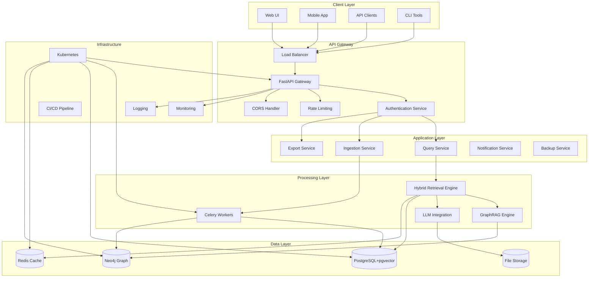
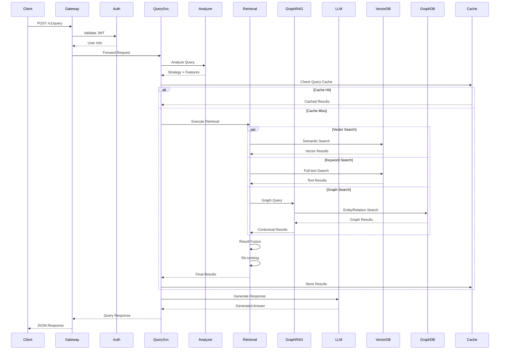
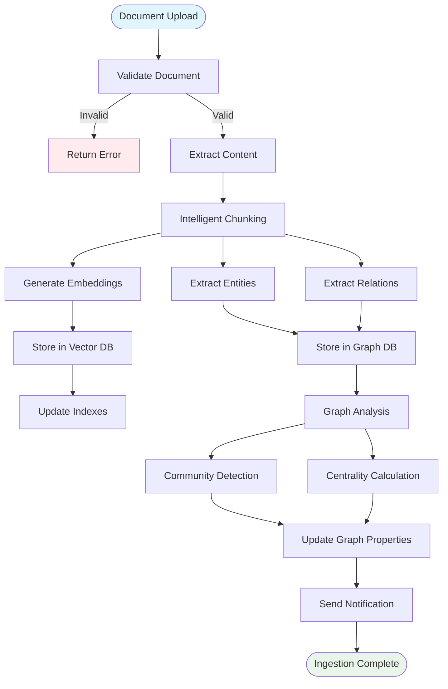
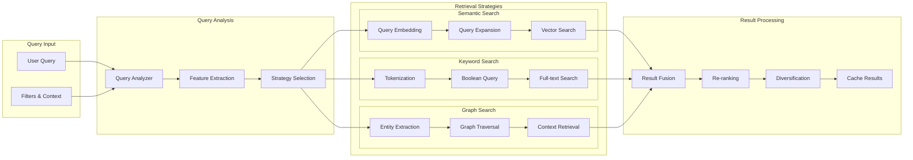
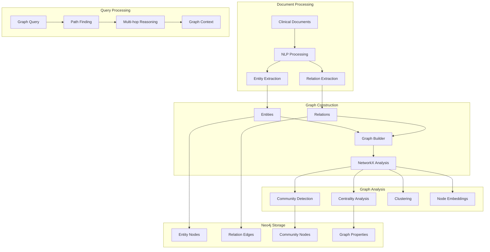
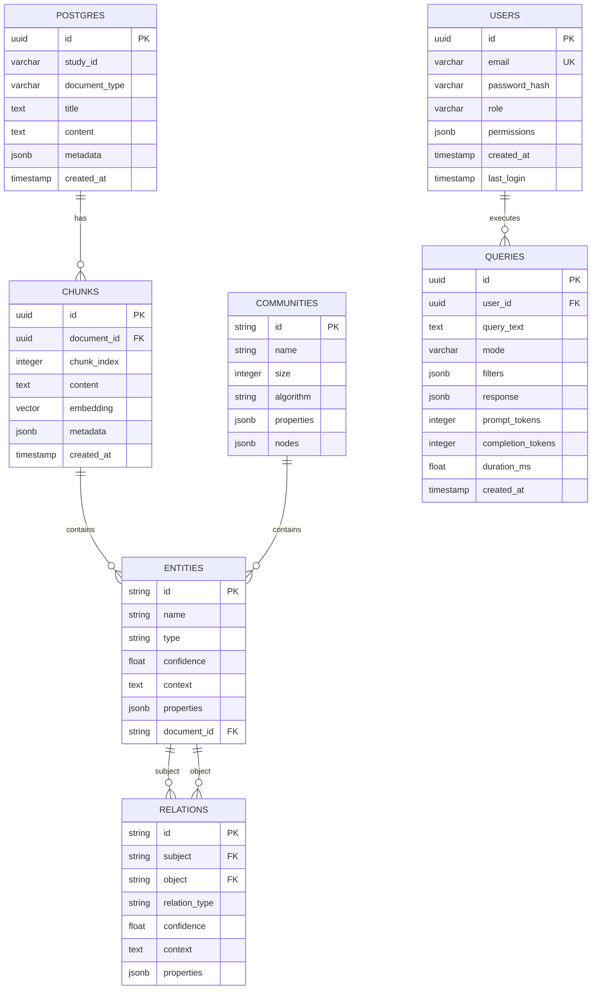
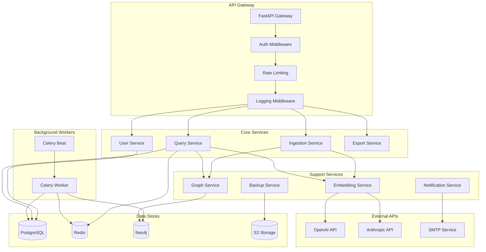
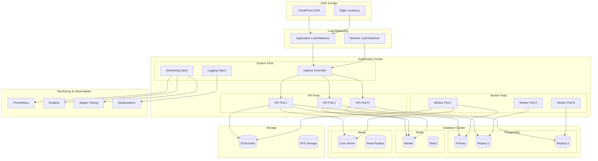
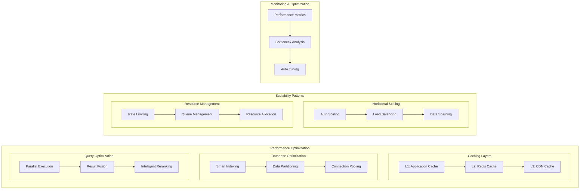

# System Architecture Diagrams

## 1. Overall System Architecture

## 2. Query Processing Flow

## 3. Data Ingestion Pipeline

## 4. Hybrid Retrieval Architecture

## 5. GraphRAG Architecture

## 6. Database Schema Architecture

## 7. Microservices Communication

## 8. Security Architecture

```mermaid
graph TB
    subgraph "External Access"
        CLIENT[Client Applications]
        FIREWALL[Web Application Firewall]
        DDOS[DDoS Protection]
    end
    
    subgraph "Authentication & Authorization"
        OAUTH[OAuth 2.0 Provider]
        JWT[JWT Service]
        RBAC[Role-Based Access Control]
        MFA[Multi-Factor Authentication]
    end
    
    subgraph "API Security"
        RATE_LIMIT[Rate Limiting]
        INPUT_VALID[Input Validation]
        OUTPUT_SAN[Output Sanitization]
        CORS[CORS Policy]
    end
    
    subgraph "Data Protection"
        ENCRYPTION[Encryption Service]
        PHI_REDACTION[PHI Redaction]
        ANONYMIZATION[Data Anonymization]
        AUDIT[Audit Logging]
    end
    
    subgraph "Infrastructure Security"
        VPC[Virtual Private Cloud]
        SECURITY_GROUPS[Security Groups]
        IAM[Identity & Access Management]
        SECRETS[Secrets Manager]
    end
    
    subgraph "Monitoring & Compliance"
        SIEM[Security Information & Event Management]
        COMPLIANCE[Compliance Monitoring]
        INCIDENT[Incident Response]
        BACKUP[Secure Backup]
    end
    
    CLIENT --> FIREWALL
    FIREWALL --> DDOS
    DDOS --> OAUTH
    
    OAUTH --> JWT
    JWT --> RBAC
    RBAC --> MFA
    
    MFA --> RATE_LIMIT
    RATE_LIMIT --> INPUT_VALID
    INPUT_VALID --> OUTPUT_SAN
    OUTPUT_SAN --> CORS
    
    CORS --> ENCRYPTION
    ENCRYPTION --> PHI_REDACTION
    PHI_REDACTION --> ANONYMIZATION
    ANONYMIZATION --> AUDIT
    
    AUDIT --> VPC
    VPC --> SECURITY_GROUPS
    SECURITY_GROUPS --> IAM
    IAM --> SECRETS
    
    SECRETS --> SIEM
    SIEM --> COMPLIANCE
    COMPLIANCE --> INCIDENT
    INCIDENT --> BACKUP
```

## 9. Deployment Architecture

## 10. Performance & Scalability

